<div align="center">

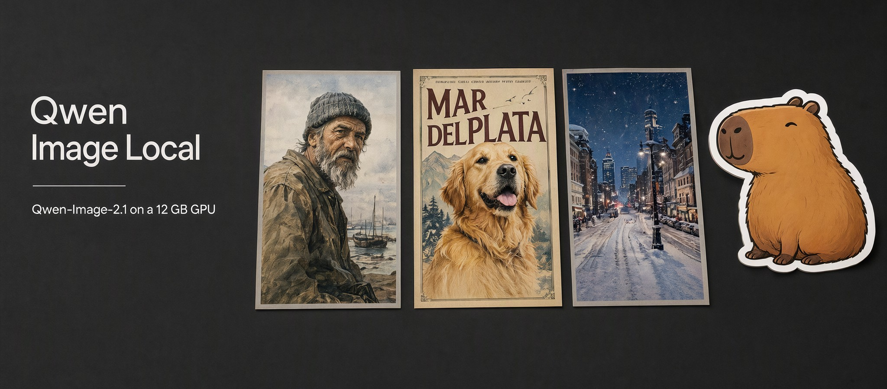

**Type a prompt or drop up to 10 photos: Qwen-Image-2.1 renders it on your 12 GB GPU in about 35 s, and nothing leaves your PC.**

[](CHANGELOG.md)
[](https://github.com/Mats2208/qwen-image-local/releases)
[](https://github.com/Mats2208/qwen-image-local/stargazers)
[](https://huggingface.co/Qwen/Qwen-Image-2.1)
[](https://mats2208.github.io/qwen-image-local/)
[](LICENSE)

<br/>

<table>
<tr>
<td align="center"><strong>12 GB</strong><br/><sub>VRAM, every stage fully on GPU</sub></td>
<td align="center"><strong>35 s</strong><br/><sub>per 1024² image, RTX 3060</sub></td>
<td align="center"><strong>10</strong><br/><sub>reference photos per edit</sub></td>
<td align="center"><strong>20</strong><br/><sub>tests vs gpt-image-2, all published</sub></td>
<td align="center"><strong>0</strong><br/><sub>uploads: prompts and photos stay on your PC</sub></td>
</tr>
</table>

**📊 Benchmark:** [mats2208.github.io/qwen-image-local](https://mats2208.github.io/qwen-image-local/) &nbsp;•&nbsp; **🛠️ Build it:** [one command](#install) &nbsp;•&nbsp; **⭐ [Star it](https://github.com/Mats2208/qwen-image-local/stargazers)** if it runs on your card: that is how other people with small GPUs find it.

</div>

---

Qwen-Image-2.1 came out on September 20, 2026. It is the first open-weight image model that is genuinely good **and** small: a 7B generator, where most good open models are 10–20B. This repo is the missing piece for people who don't own a 24 GB card: a one-click desktop app and a CLI that install it, fit it into 12 GB of VRAM, and get out of your way.

<sub>Unofficial. Not affiliated with Alibaba or the Qwen team. The model weights are non-commercial; see [License](#license).</sub>

## Showcase

<p align="center">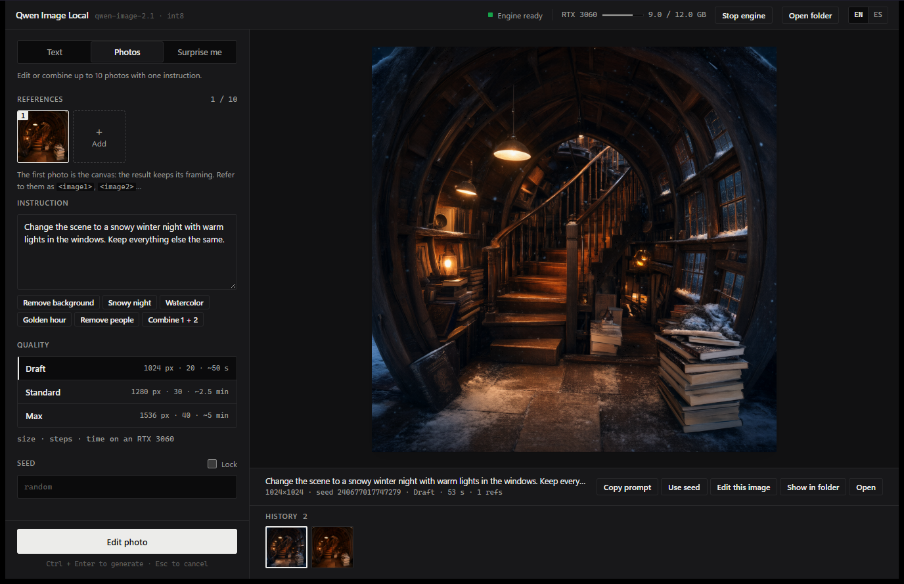</p>
<p align="center"><sub><b>Photos mode.</b> The bookstore on the right of the history strip was generated from text; "Edit this image" sent it back as a reference, one click on <b>Snowy night</b>, and 53 s later the snow and the cold light came in while the staircase, the lamps and the cat stayed put.</sub></p>

<table>
<tr>
<td width="50%">
<p align="center">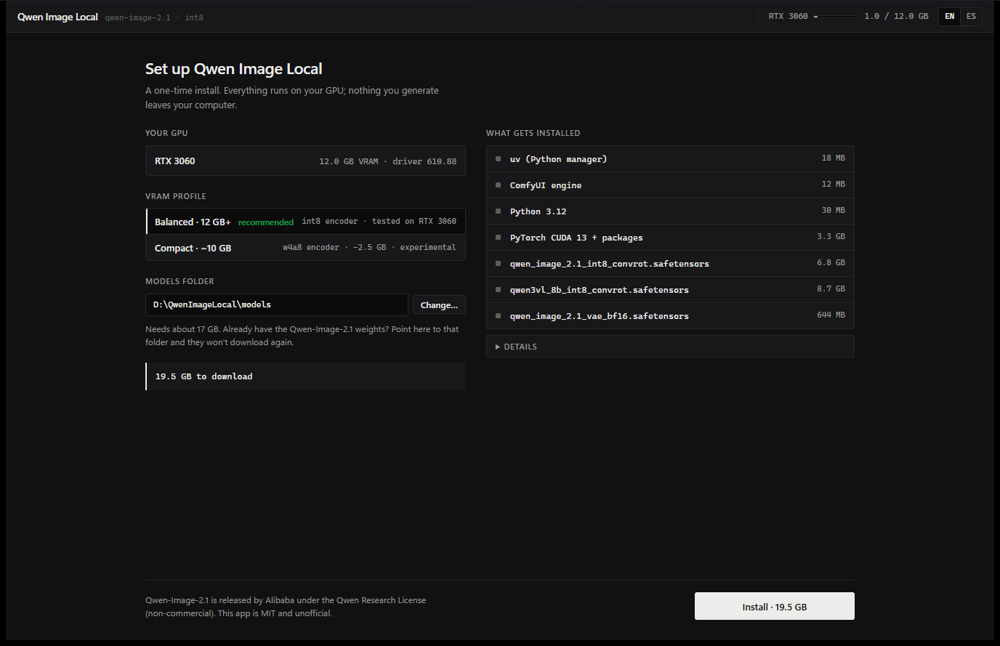</p>
<p align="center"><sub>First run. It reads your GPU, driver and free disk, recommends a profile, and shows every file before downloading. Already have the weights? Point it at that folder and they are reused.</sub></p>
</td>
<td width="50%">
<p align="center">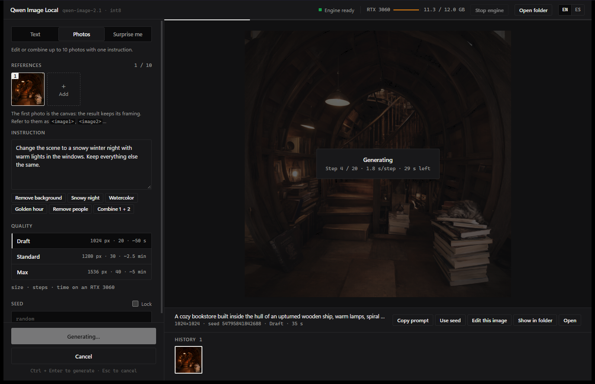</p>
<p align="center"><sub>Mid-generation. Step count, seconds per step and time left come from the engine itself; the meter top-right is your real VRAM (<b>11.3 / 12 GB</b>).</sub></p>
</td>
</tr>
</table>

<p align="center">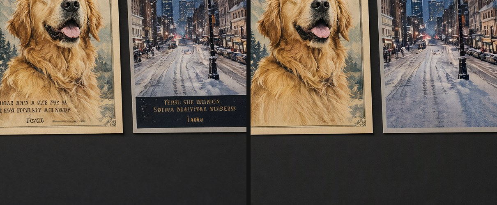</p>
<p align="center"><sub>The banner at the top was made by the model too. It rendered the title perfectly but invented small gibberish text under the pictures (left); a second pass in Photos mode, <i>"remove all the small text at the bottom…"</i>, cleaned it (right).</sub></p>

## What it does

| | Feature | Details |
|---|---|---|
| **Create** | Text → image | Draft 1024² · Standard 1.6 MP · Max native 2K, seven aspect ratios, lockable seed |
| **Transparency** | Native RGBA | Real alpha channel from the model, no background-removal tricks |
| **Edit** | 1–10 reference photos | Relight, restyle, remove objects or people, rewrite signs, combine subjects; the first photo is the canvas |
| **Surprise me** | Idea generator | Style × subject × place × light, or a curated idea; optional theme |
| **Setup** | One-command build + one-time install | Pinned ComfyUI, Python 3.12, PyTorch CUDA 13, weights with resume and SHA-256 checks |
| **CLI** | `qil` | `doctor` · `setup` · `generate` · `edit` · `surprise` · `bench` · `config` |
| **Privacy** | Local | Prompts and photos only ever go to the engine on `127.0.0.1`. Every image is saved with a `.json` of its prompt, seed and settings |

## Honest benchmark: where it wins and where it loses

20 prompts, **one run per model, no cherry-picking**. Qwen-Image-2.1 on an RTX 3060 12 GB (int8, 40 steps, native 2K) against gpt-image-2 in the cloud. Edits use real photos from Wikimedia Commons.

| Category | Qwen wins | Tie | gpt-image-2 wins |
|---|---:|---:|---:|
| Photography (6) | 0 | 1 | 5 |
| Creativity (6) | 0 | 0 | 6 |
| **Photo editing (8)** | **1** | **7** | **0** |
| **Total** | **1** | **8** | **11** |

**For editing photos it is on par with gpt-image-2**, free, private and unlimited. **For text-to-image it is not**: it follows long prompts less closely and knows less about the world (asked for a *mate*, it drew a Chinese gourd twice). Every image, prompt and verdict is on the [benchmark page](https://mats2208.github.io/qwen-image-local/).

<table>
<tr>
<td width="33%"><p align="center">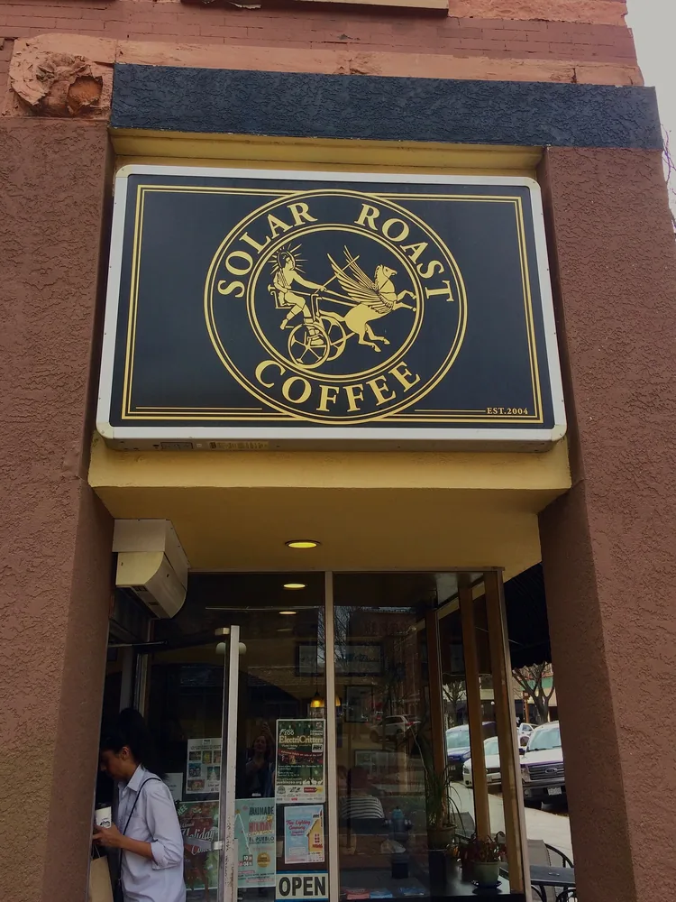</p><p align="center"><sub>Input: a real storefront</sub></p></td>
<td width="33%"><p align="center">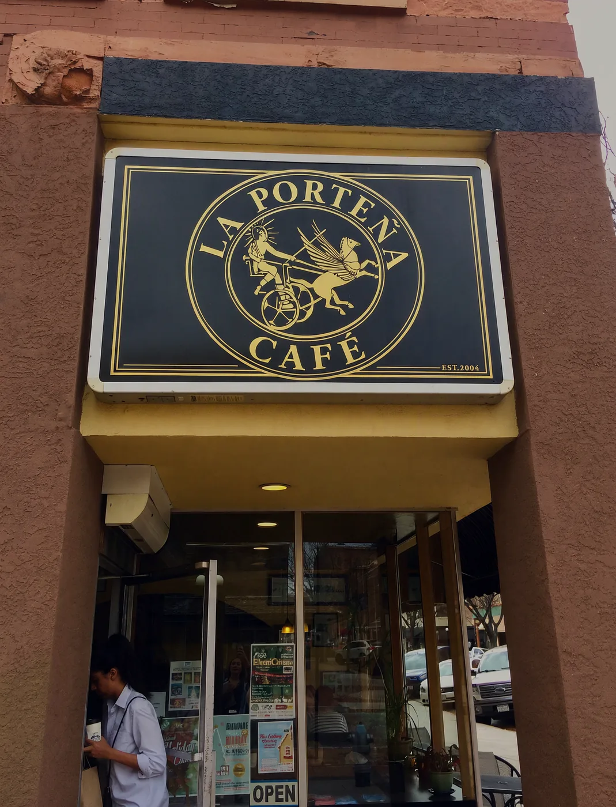</p><p align="center"><sub><b>Qwen, local:</b> "LA PORTEÑA / CAFÉ", Ñ and accent included, same gold serif, logo untouched</sub></p></td>
<td width="33%"><p align="center">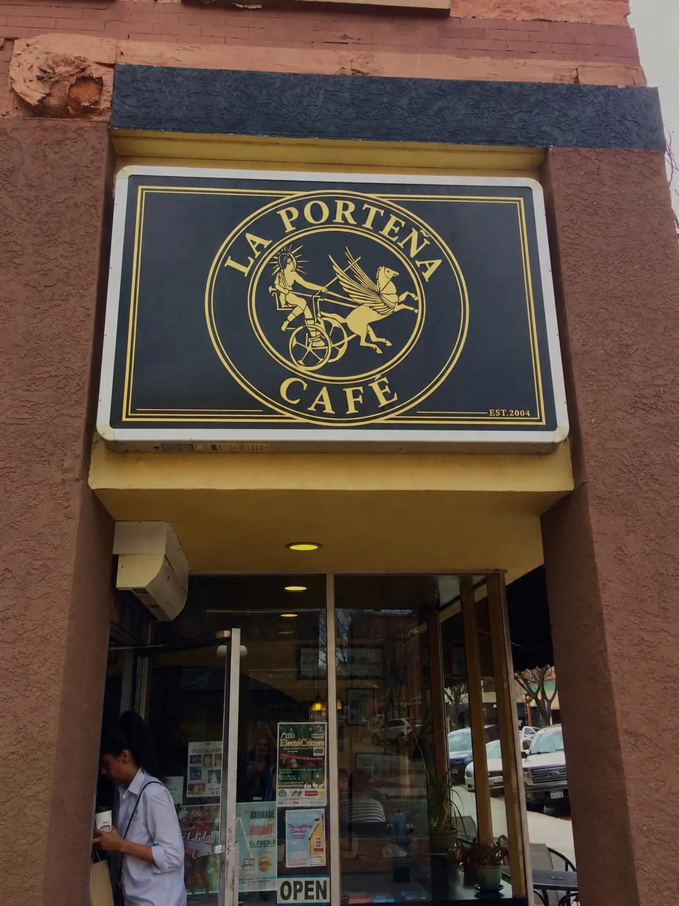</p><p align="center"><sub><b>gpt-image-2:</b> equally clean. Tie.</sub></p></td>
</tr>
<tr>
<td width="33%"><p align="center"></p><p align="center"><sub>Input: "remove the background"</sub></p></td>
<td width="33%"><p align="center">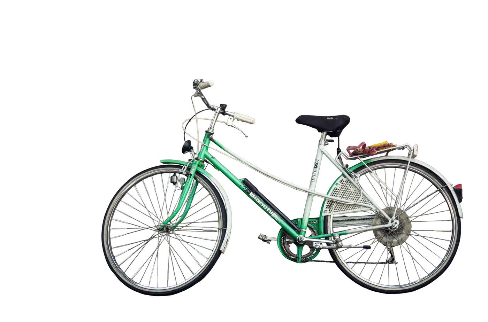</p><p align="center"><sub><b>Qwen wins:</b> the exact bicycle, same position and scale, ready to composite</sub></p></td>
<td width="33%"><p align="center">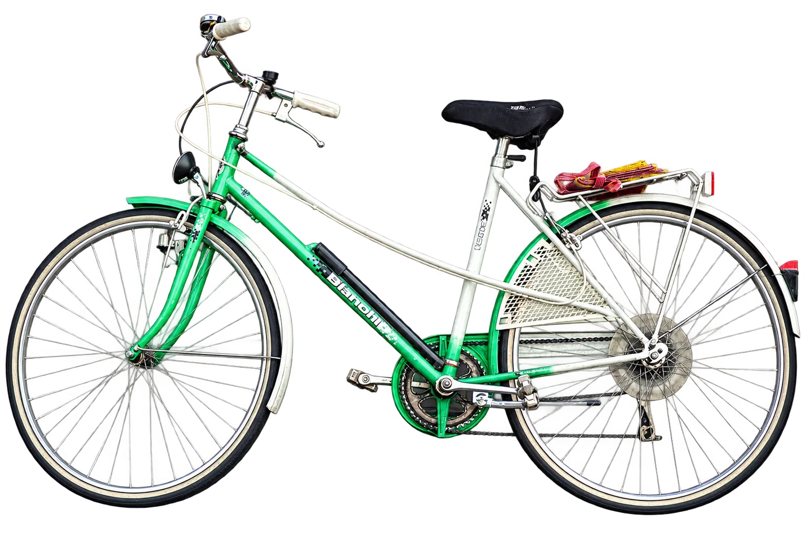</p><p align="center"><sub>gpt-image-2 redraws it larger and changes the rear rack</sub></p></td>
</tr>
<tr>
<td width="33%"><p align="center"><sub>Text-to-image:<br/><i>"infographic 'Cómo preparar mate', 6 numbered steps…"</i></sub></p></td>
<td width="33%"><p align="center">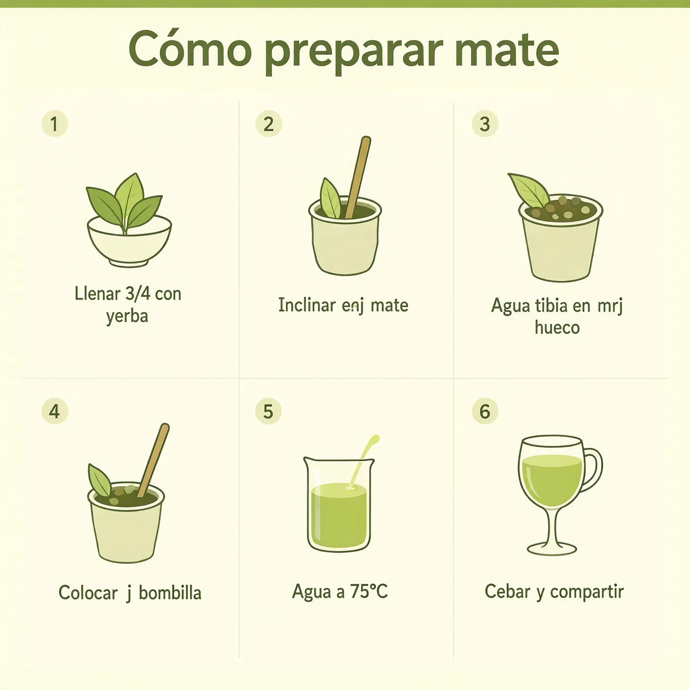</p><p align="center"><sub><b>Qwen loses:</b> big title perfect, small captions misspelled ("Inclinar <b>enj</b> mate"), cups instead of a mate</sub></p></td>
<td width="33%"><p align="center">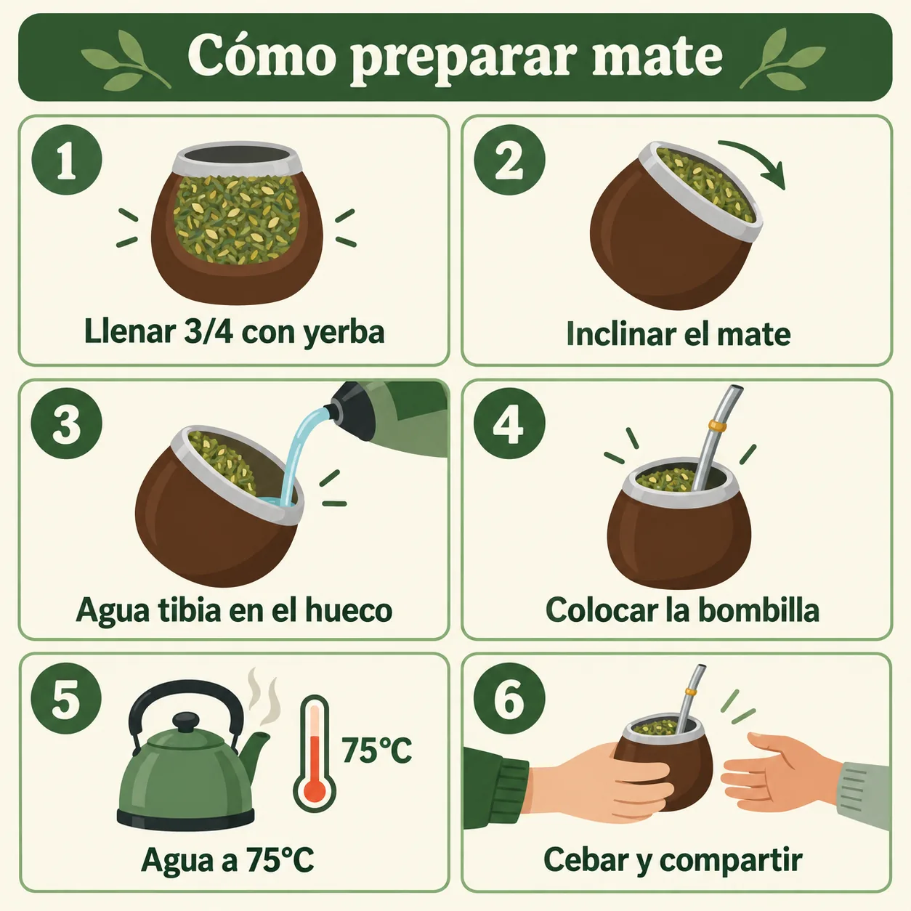</p><p align="center"><sub><b>gpt-image-2 wins:</b> every caption right, real mate icons</sub></p></td>
</tr>
</table>

## How it fits in 12 GB

The three models don't fit together: text encoder 8.9 GB + image model 6.9 GB + VAE 0.6 GB = 16.4 GB. So they run **one stage at a time, each loaded completely into VRAM**, while the others wait in system RAM. Nothing is split between CPU and GPU, which is what makes low-VRAM setups slow. Verified in the engine log (`loaded completely … full load: True` for all three stages) and by the speed: 1.35 s per step at 1024², which is compute-bound on an RTX 3060.

Two choices matter more than anything else:

- **int8 "convrot" weights, not GGUF.** Ampere and newer cards have int8 tensor cores, and ComfyUI ships native kernels for this format, so it is faster than dequantizing GGUF on the fly and close to lossless.
- **PyTorch built for CUDA 13.** With CUDA 12.8 builds, ComfyUI silently disables its optimized CUDA backend. The installer picks the right build and checks your driver (R580 or newer).

## Install

**Requirements:** Windows 10/11 · NVIDIA GPU with 12 GB (10 GB experimental, see below) · driver 580+ · ~25 GB free disk · 32 GB RAM (what it was tested with; 16 GB is untested).

### Option A · Build it yourself (recommended, ~5 min)

A binary you compile on your own PC carries no "downloaded from the internet" mark, so Windows SmartScreen won't flag it, and you know exactly what you are running.

**1. Prerequisites, once.** Paste into any terminal:

```powershell
winget install Rustlang.Rustup
winget install OpenJS.NodeJS.LTS
winget install Microsoft.VisualStudio.2022.BuildTools --override "--quiet --add Microsoft.VisualStudio.Workload.VCTools --includeRecommended"
```

Close and reopen the terminal afterwards so it picks up the new tools.

**2. Clone and build.** Pick the block for the terminal you use:

<table>
<tr><th>Terminal</th><th>Command</th></tr>
<tr><td><b>PowerShell 5.1</b><br/><sub>the one that ships with Windows</sub></td><td>

```powershell
git clone https://github.com/Mats2208/qwen-image-local; cd qwen-image-local
powershell -ExecutionPolicy Bypass -File .uild.ps1
```

</td></tr>
<tr><td><b>PowerShell 7</b><br/><sub>pwsh, Windows Terminal default</sub></td><td>

```powershell
git clone https://github.com/Mats2208/qwen-image-local; cd qwen-image-local
pwsh -ExecutionPolicy Bypass -File ./build.ps1
```

</td></tr>
<tr><td><b>CMD</b><br/><sub>Command Prompt</sub></td><td>

```bat
git clone https://github.com/Mats2208/qwen-image-local && cd qwen-image-local
.uild.cmd
```

</td></tr>
<tr><td><b>Git Bash · Warp</b><br/><sub>any bash on Windows</sub></td><td>

```bash
git clone https://github.com/Mats2208/qwen-image-local && cd qwen-image-local
./build.sh
```

</td></tr>
<tr><td><b>No terminal</b></td><td>

Download the [source zip](https://github.com/Mats2208/qwen-image-local/archive/refs/heads/main.zip), extract it and **double-click `build.cmd`**.

</td></tr>
</table>

All five run the same `build.ps1`, which checks the prerequisites (and tells you the exact command for anything missing), then leaves `qwen-image-local.exe` and `qil.exe` in `out\`. Add `-Installer` to also build the setup `.exe`. Tested with PowerShell 5.1, PowerShell 7.6, CMD and Git Bash.

**3. Run** `out\qwen-image-local.exe`. The first launch installs the engine and downloads about **19.5 GB** once: engine, Python, PyTorch, and the weights from [Hugging Face](https://huggingface.co/Comfy-Org/Qwen-Image-2.1). Downloads resume if interrupted and are checked against SHA-256.

### Option B · Prebuilt installer

Download `Qwen.Image.Local_x.y.z_x64-setup.exe` from [Releases](https://github.com/Mats2208/qwen-image-local/releases/latest) and run it; it installs for your user only, no admin. It is not code-signed (certificates are paid), so SmartScreen will warn the first time: **More info → Run anyway**.

Either way, everything lives in `%LOCALAPPDATA%\qwen-image-local` (models can go on another disk), and uninstalling is deleting that folder.

## Quick start (CLI)

`qil.exe` comes out of the same build (or the release zip) and uses the same install as the app.

```text
> qil doctor
GPU        RTX 3060 · 12.0 GB VRAM · driver 610.88 (ok)
profile    balanced (12 GB+ (int8 encoder))
  [x] uv 0.12.18 (Python manager)
  [x] ComfyUI engine
  [x] Python 3.12
  [x] PyTorch (CUDA 13) + engine packages
  [x] qwen_image_2.1_int8_convrot.safetensors (6.76 GB)
  [x] qwen3vl_8b_int8_convrot.safetensors (8.71 GB)
  [x] qwen_image_2.1_vae_bf16.safetensors (644 MB)
Ready. Try: qil generate "a red fox asleep in the snow" --preset draft
```

```bash
qil setup                                             # install; profile picked from your VRAM
qil generate "a red fox asleep in the snow" --preset draft
qil generate "a mate gourd sticker" --transparent --aspect 1:1
qil edit "Change the scene to a snowy night" -i street.jpg --preset standard
qil edit "Put the dog from <image2> next to the bike in <image1>" -i bike.jpg -i dog.jpg
qil surprise --theme capybaras
qil bench --suite bench/suite.json --preset max       # reproduce the published benchmark
```

Pass `--keep-engine` to leave the engine running between calls so each one skips the start-up.

## VRAM profiles

| Profile | Text encoder | Peak VRAM (desktop included) | 1024², 20 steps | Status |
|---|---|---:|---:|---|
| **Balanced** | int8, 8.9 GB | 11.4 GB | 32 s | Tested on RTX 3060 12 GB |
| **Compact** | w4a8, 6.3 GB | 8.9 GB | 33 s | Experimental: should fit 10 GB cards |

The compact profile cuts peak VRAM by about 2.5 GB at the same speed. **8 GB cards are untested:** the only way to emulate one here was ComfyUI's soft `--reserve-vram` cap, and peak usage still went above 8 GB. If you have an 8 or 10 GB card, a `qil bench` run on [bench/tiers](bench/tiers) would be the most useful contribution to this repo.

## What it doesn't do (yet)

- **NVIDIA on Windows only.** For AMD, Intel, Apple Silicon or cards under 8 GB, use [nihui/qwenimage-ncnn-vulkan](https://github.com/nihui/qwenimage-ncnn-vulkan): a CLI that runs on any Vulkan GPU by trading speed for memory.
- **No live preview** while sampling; you see the final image.
- **No masks or brush.** Local edits are described in words; the model supports masks and marks, the app doesn't expose them yet.
- **No prompt enhancer.** Qwen's official rewriter is a separate 9B model; it doesn't fit alongside on 12 GB.
- **Not for commercial use** while the weights stay under the Qwen Research License.

## FAQ

**What AI image model runs on a 12 GB GPU like an RTX 3060?** Qwen-Image-2.1 with int8 weights, loading one stage at a time. This app does that setup for you: about 35 s per 1024² image, about 7 minutes at native 2K.

**Is Qwen-Image-2.1 as good as gpt-image-2?** For editing photos, yes in our tests (7 ties and 1 win out of 8). For text-to-image, no (gpt-image-2 won 11 of 12).

**Can I use my existing ComfyUI models folder?** Yes. Choose it on the setup screen or run `qil setup --models-dir <folder>`. Files that match in size are not downloaded again.

## Repo layout

```
crates/qil-core   installer, engine lifecycle, generation client, GPU detection (Rust)
crates/qil-cli    the qil command line
app/              Tauri 2 desktop app (Rust + plain HTML/CSS/JS, English and Spanish)
bench/            suite.json, input photos with credits, results, verdicts, site builder
docs/             GitHub Pages benchmark site
```

`build.ps1` / `build.cmd` / `build.sh` wrap the two builds: `cargo build --release -p qil-cli` and `npx tauri build` in `app/`.

## Help it spread

This exists because a 12 GB card deserved better than "buy a 4090". If it ran on yours:

- **⭐ [Star the repo](https://github.com/Mats2208/qwen-image-local/stargazers).** It is the single thing that makes GitHub and search engines show it to the next person with a small GPU.
- **Share it** where people ask "what can I run on my card?": [r/StableDiffusion](https://www.reddit.com/r/StableDiffusion/), [r/LocalLLaMA](https://www.reddit.com/r/LocalLLaMA/), [X / Twitter](https://twitter.com/intent/tweet?text=Qwen-Image-2.1%20running%20fully%20in%20VRAM%20on%20a%2012%20GB%20GPU%2C%20desktop%20app%20%2B%20honest%20benchmark%20vs%20gpt-image-2&url=https%3A%2F%2Fgithub.com%2FMats2208%2Fqwen-image-local), your Discord.
- **Post your numbers.** Own an 8, 10 or 16 GB card? Run `bash bench/tiers/run.sh` and open an issue with `results.json`. Real 8 GB results are the most wanted data point here.

## Credits

[Qwen-Image-2.1](https://github.com/QwenLM/Qwen-Image-2.1) by the Qwen team at Alibaba · [ComfyUI](https://github.com/comfyanonymous/ComfyUI) and the [Comfy-Org](https://huggingface.co/Comfy-Org/Qwen-Image-2.1) int8 repacks · [uv](https://github.com/astral-sh/uv) · [Tauri](https://tauri.app). Benchmark photos from Wikimedia Commons; authors and licenses in [bench/inputs/credits.json](bench/inputs/credits.json).

## License

The code in this repo is [MIT](LICENSE). The Qwen-Image-2.1 weights, which the app downloads from Hugging Face, are under the [Qwen Research License](https://huggingface.co/Qwen/Qwen-Image-2.1/blob/main/LICENSE) and are **not licensed for commercial use**. ComfyUI is GPL-3.0 and runs as a separate process. Edits of CC BY-SA benchmark photos are CC BY-SA 4.0.
